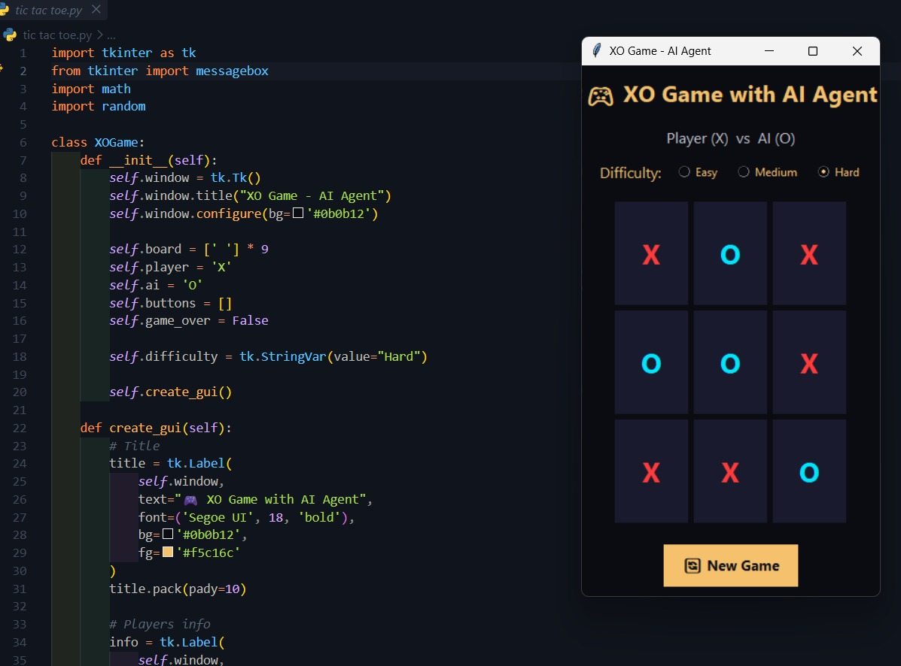

# Tic Tac Toe AI

A Python-based Tic Tac Toe game with an AI opponent.

## Features

- Play against an AI opponent
- Three difficulty levels: Easy, Medium, and Hard
- Hard mode uses the Minimax algorithm
- Simple graphical interface built with Tkinter

## Technologies

- Python
- Tkinter
- Minimax Algorithm

## Screenshot



## How to Run

```bash
python xo.py
